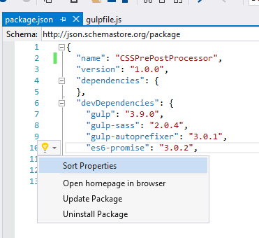
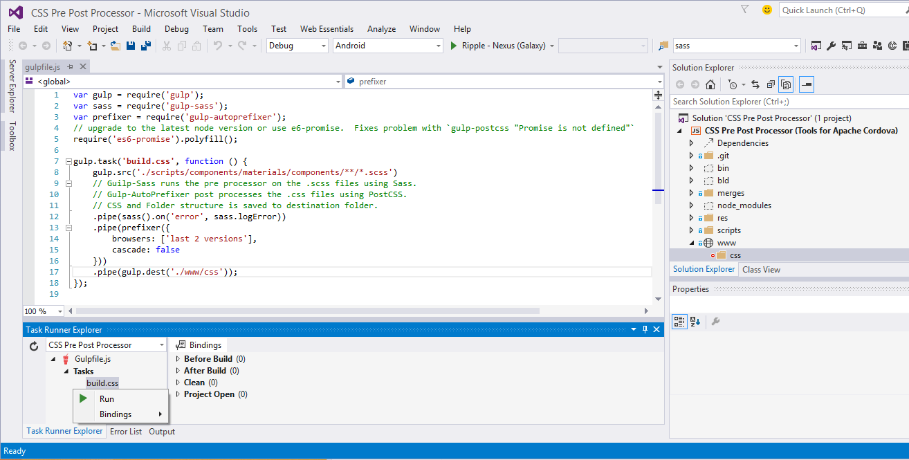

# VS2015_CSS_Pre-Post_Processing
**Note: The project files are for use with Visual Studio 2015 + Tools for Apache Cordova.**

The purpose of the files are to demonstrate how to use Sass and PostCSS AutoPrefixer using gulp-sass and gulp-autoprefixer.

In this example, the Gulp automated process simply process the files from `scripts\components\materials\components` and copies them into `www\css`.

To start, download the repository files and open the CSS Pre Post Processor.sln in Visual Studio 2015.

Note: Make sure to install Visual Studio 2015 Tools for Apache Cordova. 

## CSS Preprocessor and Postprocessor

- Sass will be used for our preprocessor.
- PostCSS will be used for our postprocessor.

CSS preprocessors take code written in a preprocessor language (example .scss) and convert the code into .css. The output is well formatted, and standard CSS stylesheets.

***.scss*** 

```.scss
a {
    display: flex;
}
```

***Sass converted to .css***

```.css
a {
  display: -webkit-flex;
  display: -ms-flexbox;
  display: flex;
}
```

CSS postprocessors parse CSS and add vendor prefixes to CSS rules using values from [Can I Use](http://caniuse.com/)

**More information about Sass**: Click the following link:
[http://sass-lang.com](http://sass-lang.com/)

## Node and Package.json
Both Sass and PostCSS need to be installed.  Visual Studio 2015 uses `package.json` to automate and simplify the installation process using the NPM package manager for node.

Add the following NPM packages into the devDependencies object. Use the devDependencies object instead of dependencies object because these modules are being used for development and are not required to run in the App. 



```CSSprocessing
{
  "name": "CSSPrePostProcessor",
  "version": "1.0.0",
  "dependencies": {
  },
  "devDependencies": {
    "gulp": "3.9.0",
    "gulp-sass": "2.0.4",
    "gulp-autoprefixer": "3.0.1",
    "es6-promise": "3.0.2",
    "autoprefixer": "6.0.2"
  }
}
```

*Note*: Use the VS2015 package.json to both install and uninstall npm packages.

More information about package.json can be found here: [https://docs.npmjs.com/files/package.json](https://docs.npmjs.com/files/package.json)

## Gulp 

The gulpfile.js contains the code to run the CSS pre and post processing.  Use the following code as a starting point.


```gulpfile.js
var gulp = require('gulp');
var sass = require('gulp-sass');
var prefixer = require('gulp-autoprefixer');
// upgrade to the latest node version or use e6-promise.  Fixes problem with `gulp-postcss "Promise is not defined"`
require('es6-promise').polyfill();

gulp.task('build.css', function () {
    gulp.src('./scripts/components/materials/components/**/*.scss')
    // Guilp-Sass runs the pre processor on the .scss files using Sass.
    // Gulp-AutoPrefixer post processes the .css files using PostCSS.
    // CSS and Folder structure is saved to destination folder.
    .pipe(sass().on('error', sass.logError))
    .pipe(prefixer({
        browsers: ['last 2 versions'],
        cascade: false
    }))
    .pipe(gulp.dest('./www/css'));
});
```

- [Gulp-Sass information](https://www.npmjs.com/package/gulp-sass)
- [Gulp-autoprefixer information](https://www.npmjs.com/package/gulp-autoprefixer)

##Running Gulp Tasks in the Visual Studio Task Runner


Run the gulp task by using the Visual Studio 2015 Task Manager window(View > Other Windows > Task Manager Explorer).

To run the task, select the task and right click


After running the task, verify there are no errors `Process terminated with code 0.` and open the destination folder where the .css is being saved.

## License
Unless otherwise mentioned, the code samples are released under the MIT license.

```
The MIT License (MIT)

Dean Biele

Permission is hereby granted, free of charge, to any person obtaining a copy
of this software and associated documentation files (the "Software"), to deal
in the Software without restriction, including without limitation the rights
to use, copy, modify, merge, publish, distribute, sublicense, and/or sell
copies of the Software, and to permit persons to whom the Software is
furnished to do so, subject to the following conditions:

The above copyright notice and this permission notice shall be included in all
copies or substantial portions of the Software.

THE SOFTWARE IS PROVIDED "AS IS", WITHOUT WARRANTY OF ANY KIND, EXPRESS OR
IMPLIED, INCLUDING BUT NOT LIMITED TO THE WARRANTIES OF MERCHANTABILITY,
FITNESS FOR A PARTICULAR PURPOSE AND NONINFRINGEMENT. IN NO EVENT SHALL THE
AUTHORS OR COPYRIGHT HOLDERS BE LIABLE FOR ANY CLAIM, DAMAGES OR OTHER
LIABILITY, WHETHER IN AN ACTION OF CONTRACT, TORT OR OTHERWISE, ARISING FROM,
OUT OF OR IN CONNECTION WITH THE SOFTWARE OR THE USE OR OTHER DEALINGS IN THE
SOFTWARE.
```
